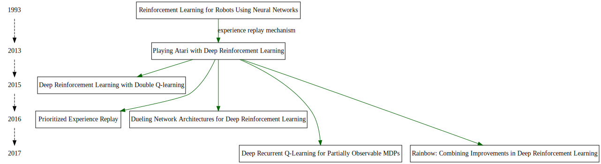
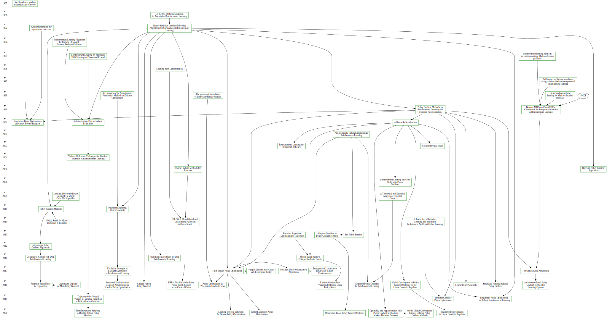

## Acknowledgement
Project [Reinforcement_Leanring_An_Introduction](https://github.com/Tony-Tan/Reinforcement_Leanring_An_Introduction) has been merged into this project. 
And that project has been supported by [jetbrains](https://www.jetbrains.com/) 
 

## Hello everyone, I'm Anthony Tan, an independent AI researcher. 

You can find my blog and research notes on:
1. [anthony-tan.online](https://anthony-tan.online)  👋

2. [rn.anthony-tan.online](https://rn.anthony-tan.online) 👋

3. 

## This Project Contains All Experiment Codes of the Paper I've Read
- 1951
    1. [A Stochastic Approximation Method](./Robbins-Monro_Method)
  
- 1986
    1. [Stochastic approximation for Monte Carlo optimization](./Stochastic_Approximation_for_Monte_Carlo_Optimization)
- 2013
    1. [Playing Atari with Deep Reinforcement Learning](./DQN)
- 2015
    1. [Human-level control through deep reinforcement learning](./DQN)
    2. [Deep Reinforcement Learning with Double Q-learning](./double_DQN)
    
- 2016
    1. [Dueling Network Architectures for Deep Reinforcement Learning](./dueling_network)
    2. [Prioritized Experience Replay](./proportional_prioritization)

## Maps in Reinforcement Learning Algorithms
[./Maps](./Maps)
All maps below are coded by graphviz language.
Command on OS X with graphviz:
<code>dot the-name-of-your-dot-file.dot -Tsvg -o output-file-name.svg</code>

### Concepts in 'Reinforcement Learning: an Introduction'

### Graph of DQN papers

### Graph of PG papers
