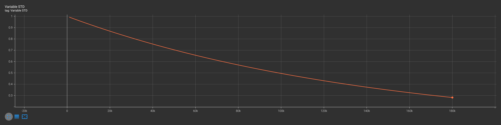
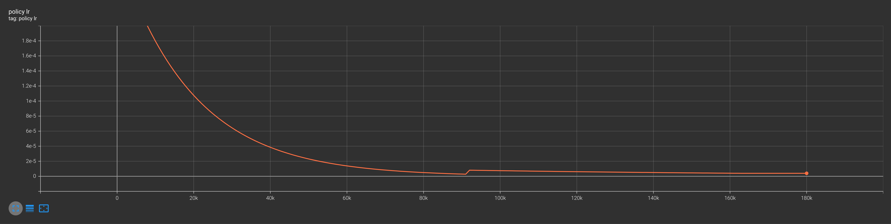
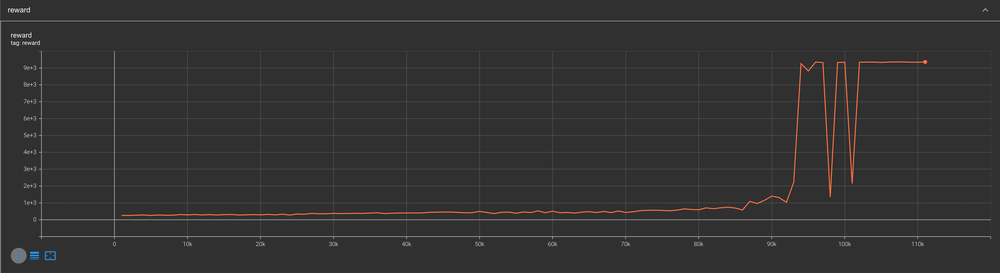
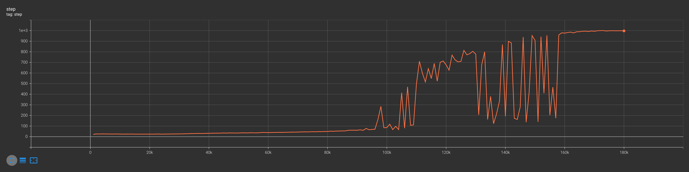
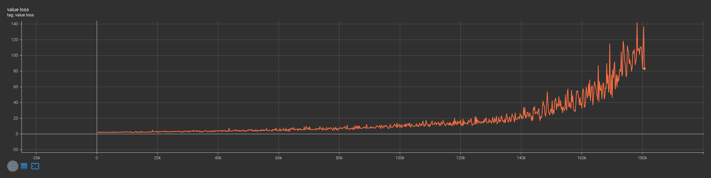

# Proximal Policy Optimization Algorithms(PPO)
reproduce by python and pytorch
video can be found at: [https://www.youtube.com/watch?v=Hq9Zc7ISTmQ&t=37s](https://www.youtube.com/watch?v=Hq9Zc7ISTmQ&t=37s)
InvertedDoublePendulum-v2 training processes:

